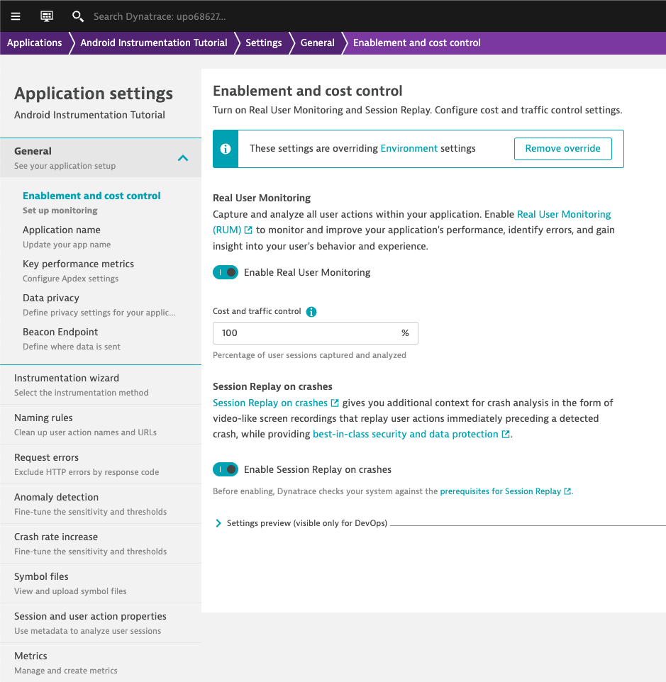
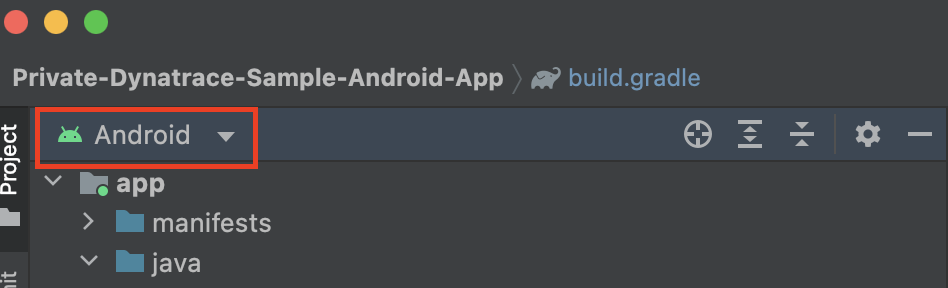
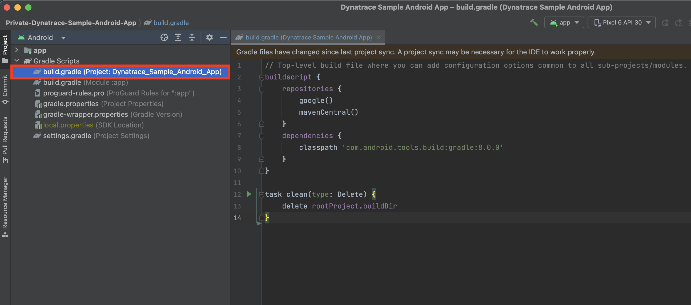
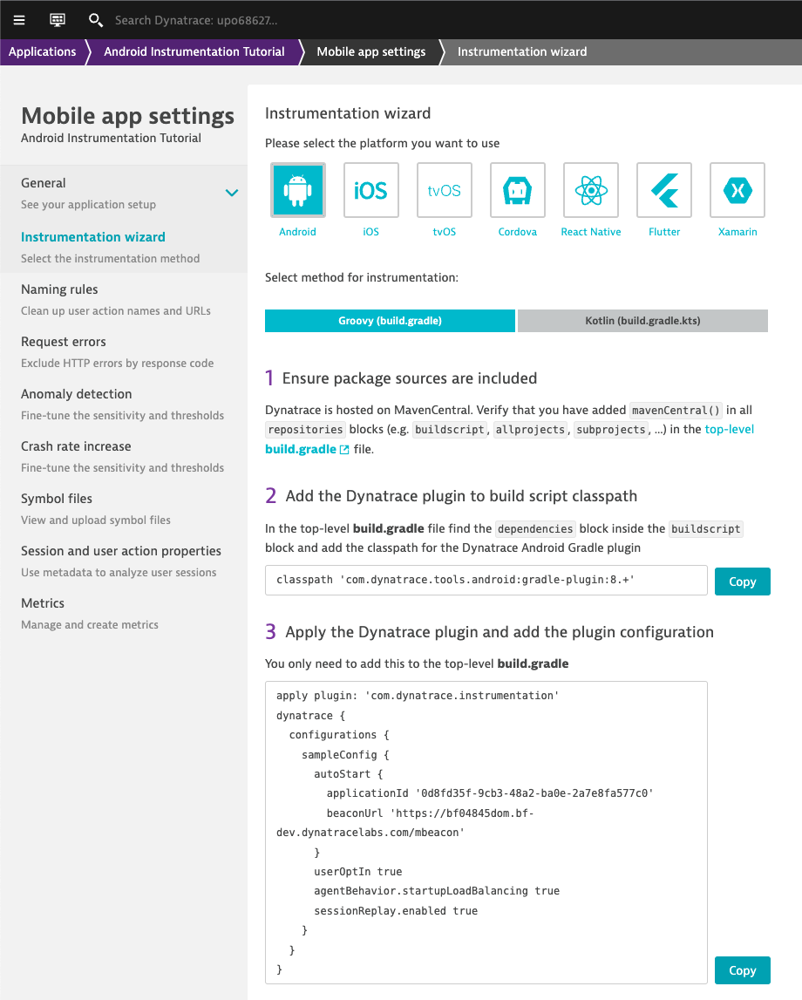
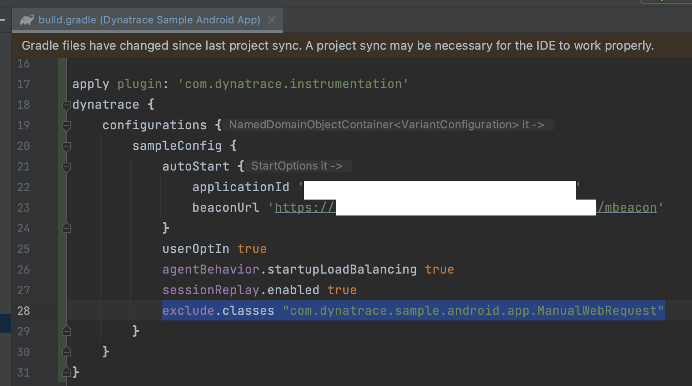
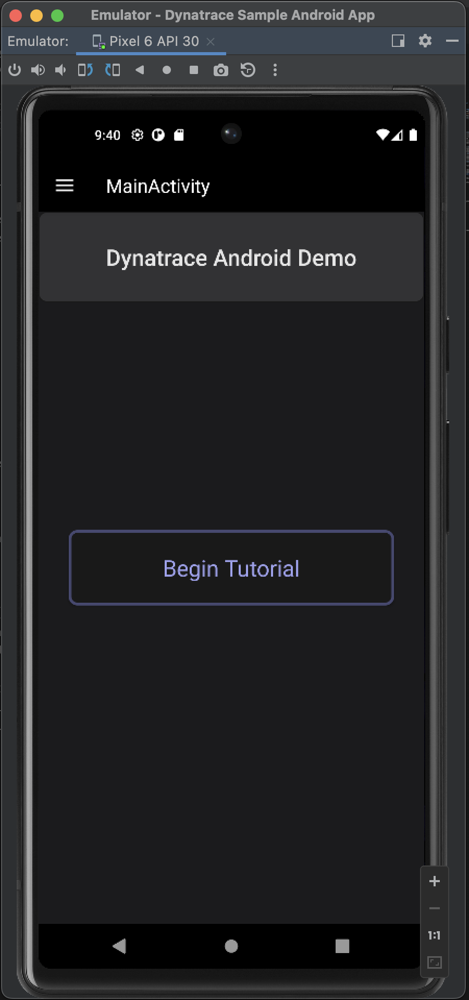
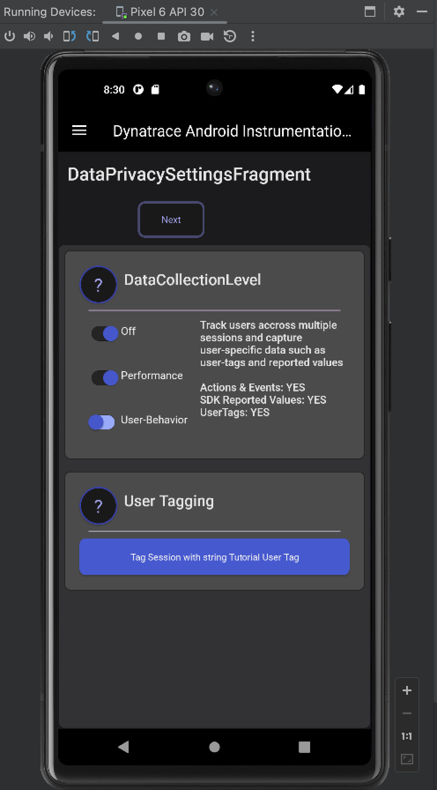

Dynatrace Android Tutorial Application
====================================

> **Note**
> This product is not officially supported by Dynatrace!

___

Table of Contents
-----------------

- [Dynatrace Android Tutorial Application](#dynatrace-android-tutorial-application)
  - [Table of Contents](#table-of-contents)
  - [About](#about)
    - [Helpful Documentation \& Resources](#helpful-documentation--resources)
    - [Covered in this tutorial](#covered-in-this-tutorial)
  - [Pre-requisites](#pre-requisites)
  - [Initial Setup](#initial-setup)

___

About
-----

This Sample Android Mobile App is a tutorial for Dynatrace Mobile Monitoring that can be instrumented and run on Android Emulators or devices. 

While the app itself serves as a tutorial that users can run and learn from directly, it was designed to be easy to use and by having access to the source code of the application, users can see exactly which methods and calls translate into the session data visible in the UI

### Helpful Documentation & Resources
- Dynatrace Public Documentation for Android Monitoring
  - [Instrument Android Apps](https://www.dynatrace.com/support/help/shortlink/android-hub)

### Covered in this tutorial
- **Data Privacy**
  - DataCollectionLevel and User opt-in
  - User Tagging
- **User Action Monitoring**
  - Automatic Instrumentation
  - Action Naming
  - Modifying Actions with SDK
  - Manual Instrumentation & Custom Actions
- **Web Request Monitoring**
  - Standalone web requests (requests with no linked user action)
  - Linked web requests (requests that are linked to user actions)
  - Manually tag and monitor web requests
- **Crash Analysis & Session Replay**
  - Report Crashes
  - Configure Masking for Session Replay
- **Data & Metrics**
  - Reporting Errors, Events, and Values
  - Create User Action and User Session Properties
- **Advanced Topics**
  - Adding Custom HTTP Headers to Beacon Values

___

Pre-requisites
--------------------------------------------------

  - **Android Studio Installed & Android 13 SDK (API 33) or higher installed**
    - Android Studio > Tools > SDK Manager
  - **Android Emulator OR Physical Device with USB Debugging Enabled**
    - Recommended to use API 33 or higher when creating Emulator
    - Android Studio Documentation - [Create and manage virtual devices](https://developer.android.com/studio/run/managing-avds)
  - **Dynatrace Tenant with a Mobile Application created in the UI**
    - Session Replay must be enabled: (Dynatrace UI Mobile App Settings) General > Enablement and cost control

{height=400}

___

Initial Setup
--------------------

1. **Download & Open with Android Studio, and set project view to 'Android'**
   -  [Github documentation for getting a Git Repository](https://git-scm.com/book/en/v2/Git-Basics-Getting-a-Git-Repository)

{height=100}

2. **Open the Project [build.gradle](./build.gradle) file and follow the steps 1-3 from the Instrumentation Wizard (Mobile App in Dynatrace > ... > Settings > Instrumentation Wizard)**
   - NOTE: SKIP STEP 4! The code snippet required to enable data collection when UserOptIn is enabled has already been implemented in the class **DataPrivacySettingsFragment.java**

{height=400}
{height=400}

3. Add the line `exclude.classes "com.dynatrace.sample.android.app.ManualWebRequest"` to the sampleConfig section of the Agent configuration that was added in the last step
   - Manually instrumenting web requests that are automatically instrumented is not supported, and automatic instrumentation of web requests is enabled by default, so in order to provide an example for manually instrumenting web requests, a separate class was created that needs to be excluded from automatic instrumentation

{height=300}

4. **Build and Run the app**
   - File > Sync Project with Gradle Files (Wait for this to complete)
   - Run > Run 'app'

{height=400}

5. **Enable sending of Data for the agent since UserOptIn is enabled**   
   - Click on **Begin Tutorial** or open the navigation with the hamburger menu in the top-left corner of the app and press **Data-Privacy Settings**
   - Toggle the switch that's labeled **User-Behavior** to enable sending of data
   
{height=400px}

___